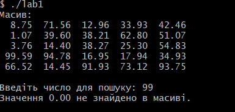

# LAB1
##ВАРІАНТ 8 

##ЗАВДАННЯ 

Напишіть програму на ANSI C для заповнення масиву випадковими числами з плаваючою точкою. Реалізуйте функцію для пошуку всіх індексів заданого числа у масиві. Реалізуйте можливість використовувати багатовимірні масиви.

## Опис

Ця лабораторна робота, яка демонструє роботу з двовимірними масивами написана на  мові C. Моя програма заповнює масив випадковими числами, виводить його на екран, а потім шукає задане користувачем значення .Реалізовано можливість використовувати багатовимірні масиви. 

[Переглянути код програми (lab1.c)](lab1.c)

##Виконання програми

