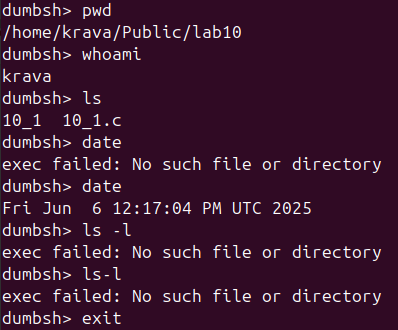

## ЛАБА 10-11 

## Код програми
[Переглянути код програми](lab10_1)(lab10_1.c)

## Код
## ЗАВДАННЯ 1(Dumb Shell)

## Опис програми
Програма реалізує командну оболонку shell, щоб показати принципи управління процеами в UNIX  системі. Працює за допомогою нескінченного циклу , зчитуючи команди користувача, виконуючи, кожну команду за допомоги патерну fork-exec-wait , сист. виклик fork створює дочірній процес , потім за допомогою execlp переміщує на введену програму , а батьківський процес за допомогою wait очікує завернення. В програмі є вбудована команда exit для завершення . Простестувавши програму , робимо висновки що працює програма з бзовими командами, такі команди як cd чи ls -l  не підтримує

## Виконання програми

## ЗАВДАННЯ 2

Створіть програму, де кожен процес породжує два нових дочірніх процеси. Побудуйте дерево з 3 рівнів.

## Опис програми

Програма будує трирівневе деерво процесів, де батьківсткий процес додає два дочірніх . Програма працює за допомогою рекурсивної функції, викликається fork для створення нових процесів .Кожен процес виводить інформацію про свій PID , про PPID та номер рівня. 

## Код програми
[Переглянути код програми [lab10-11/lab10_2](lab10_2.c)

## Виконання програми

![Результат виконання][lab10-11/lab10_2](10_2.png)

