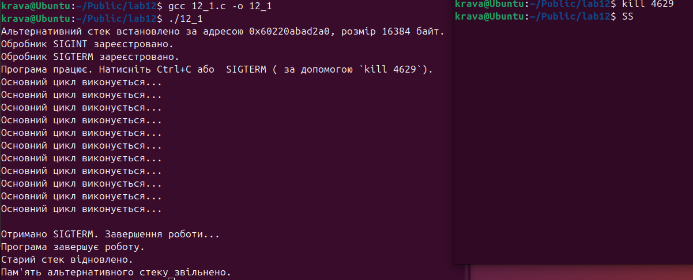

## ПРАКТИЧНА 12-13

## ЗАВДАННЯ 

Напишіть програму, яка обробляє SIGINT або SIGTERM і використовує sigaltstack, щоб сигнал не завадив основному стеку.

## КОД ЗАВДАННЯ 
[Переглянути код програми](lab12.c)

## ОПИС ПРОГРАМИ

Програма показує обробку системних сигналів, таких як SIGNIT ТА SIGTERM, перша для закінчення програми за допомоги ctrl+c , другазапит на завершення за допомоги другого стеку. Функція main в програмі виділяє память, встановлює другий стек,налаштовує структуру sigaction, обробляє сигнали , імітує безперервну роботу циклу та звільняє память. Функція signal_handle обробляє сигнали . ВИкликається коли програма отримує сигнал , signum передає номер отриманого сигналу.

## РЕЗУЛЬТАТ ВИКОНАННЯ 

