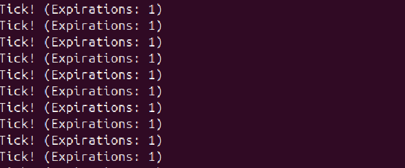

## ПРАКТИЧНА 14 

## ЗАВДАННЯ 

Вбудуйте timerfd_create() замість timer_create() для синхронної обробки через select() або epoll.

## КОД ЗАВДАННЯ 
[Переглянути код програми](lab14.c)

## ОПИС

Програма демонструє реалізацію таймера , який виводить щосекунди та виводить цю інформацію лоя користувача . Створює спеціальний об'єкт таймера у вигляді файлового дескриптора за допомогою timerfd_create.Функція timerfd_create() створює таймер, який є  файловим дескриптором. Коли таймер спрацьовує, цей файловий дескриптор стає готовим до читання. Це дозволяє вбудувати його в цикл обробки подій разом з іншими файловими дескрипторами за допомогою select(), poll() або epoll()ПОРЫВГЮЮЧИ, старіший таймер, що створюється через timer_create(), працює інакше. Його механізм сповіщення — це сигнал (наприклад, SIGALRM). Сигнали є асинхронним механізмом, який перериває основний потік виконання програми

## РЕЗУЛЬТАТ ВИКОНАННЯ 

