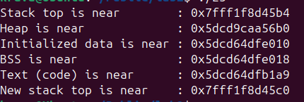
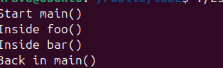

# ПРАКТИЧНА 2 

## Завдання 1 
Напишіть програму для визначення моменту, коли time_t
закінчиться.Дослідіть, які зміни відбуваються в залежності від 32- та
64-бітної архітектури. Дослідіть сегменти виконуваного файлу.

## Код
[Код програми ](lab2_1.c)

## Опис коду
Програма визначає розмір time_t, знаходить його максимальне значення, а потім виводить відповідну дату й час у форматі UTC. Якщо значення не може бути перетворене на дату, повідомляється про помилку. 

## Результат
  

## Завдання 2_2
1. Скомпілюйте програму ;hello world, запустіть ls -l для
виконуваного файлу, щоб отримати його загальний розмір, і
запустіть size, щоб отримати розміри сегментів всередині нього.
2. Додайте оголошення глобального масиву із 1000 int,
перекомпілюйте й повторіть вимірювання. Зверніть увагу на
відмінності.
3. Тепер додайте початкове значення в оголошення масиву
(пам’ятайте, що C не змушує вас вказувати значення для кожного
елемента масиву в ініціалізаторі). Це перемістить масив із сегмента

BSS у сегмент даних. Повторіть вимірювання. Зверніть увагу на
різницю.
4. Тепер додайте оголошення великого масиву в локальну функцію.
Оголосіть другий великий локальний масив з ініціалізатором.
Повторіть вимірювання. Дані розташовуються всередині функцій,
залишаючись у виконуваному файлі? Яка різниця, якщо масив
ініціалізований чи ні?
5. Які зміни відбуваються з розмірами файлів і сегментів, якщо ви
компілюєте для налагодження? Для максимальної оптимізації?

## Код
[Код програми ](lab2_2.c)

## Опис коду
Отримали загальний розмір і розмір сегментів. 

## Результат
  

## Код
[Код програми ](lab2_2_1.c)

## Опис коду
 Збільшився bss у команды size на 4000 байтів так як не ініціалізовано змінна а іде в bss.

## Результат
  

## Код
[Код програми ](lab2_2_2.c)

## Опис коду
В bss зменшується натомість data збільшується, бо масив ініціалізований йде в data

## Результат
  

## Код
[Код програми ](lab2_2_3.c)

## Опис коду
Розмір майже не змінюється.

## Результат
  

## Завдання 3
Знайдіть розташування сегментів даних і тексту, а також купи всередині
сегмента даних, оголосіть змінні, які будуть поміщені в ці сегменти, і
виведіть їхні адреси.
Збільшіть розмір стека, викликавши функцію й оголосивши кілька
великих локальних масивів. Яка зараз адреса вершини стека?
Примітка: стек може розташовуватися за різними адресами на різних
архітектурах та різних ОС. Хоча ми говоримо про вершину стека, на
більшості процесорів стек зростає вниз, до пам’яті з меншими значеннями
адрес.

## Опис 
Програма показує адреси обєктів , що дозволяє побачити як організована память під час виконання програми.

[Код](lab2_3/lab2_3.c)

## Результат 

## Завдання 4

| gstack                           | gdb                         |
|----------------------------------|-------------------------------|
| Автоматично, швидко              | Інтерактивний, складніший     |
| Тільки стек                      | Повний контроль над процесом  |
| Може бути заборонено без sudo    | Потрібен root для attach      |

## Завдання 5 
Відомо, що при виклику процедур і поверненні з них процесор
використовує стек.Чи можна в такій схемі обійтися без лічильника команд
(IP), використовуючи замість нього вершину стека? Обґрунтуйте свою
відповідь та наведіть приклади.

## Опис 
Програма демонструє, як  використовує лічильник команд  та стек при виклику і поверненні з функцій. У програмі послідовно викликаються функції main, foo і bar. При кожному виклику функції.Цей приклад ілюструє, що IP і стек взаємодіють, але IP не можна замінити стеком.Тобто повністю замінити лічильник команд стеком ми не можемо. IP необхідний для визначення поточної іструкції.

[Код](lab2_5/lab2_5.c)

## Результат 

## Завдання 6

Реалізуйте експлойт для переповнення буфера.

## Опис 
Програма реалізує експлойт буфера за допомогою  функцію gets, для зчитування введеного користувачем данних в буфер. Використання gets призведе до переповнення так як функція не зчитує розмір введених данних , щоб убезпечити себе від цього можна використати  та безпечніше використати fgets яка контрулює це. 

[Код](lab2_6/lab2_6.c)

