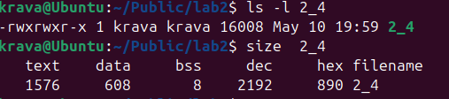

# ПРАКТИЧНА 2 

## Завдання 1 
Напишіть програму для визначення моменту, коли time_t
закінчиться.Дослідіть, які зміни відбуваються в залежності від 32- та
64-бітної архітектури. Дослідіть сегменти виконуваного файлу.

## Код
[Код програми ](lab2_1.c)

## Опис коду
Програма визначає розмір time_t, знаходить його максимальне значення, а потім виводить відповідну дату й час у форматі UTC. Якщо значення не може бути перетворене на дату, повідомляється про помилку. 

## Результат
  

## Завдання 2_2
1. Скомпілюйте програму ;hello world, запустіть ls -l для
виконуваного файлу, щоб отримати його загальний розмір, і
запустіть size, щоб отримати розміри сегментів всередині нього.
2. Додайте оголошення глобального масиву із 1000 int,
перекомпілюйте й повторіть вимірювання. Зверніть увагу на
відмінності.
3. Тепер додайте початкове значення в оголошення масиву
(пам’ятайте, що C не змушує вас вказувати значення для кожного
елемента масиву в ініціалізаторі). Це перемістить масив із сегмента

BSS у сегмент даних. Повторіть вимірювання. Зверніть увагу на
різницю.
4. Тепер додайте оголошення великого масиву в локальну функцію.
Оголосіть другий великий локальний масив з ініціалізатором.
Повторіть вимірювання. Дані розташовуються всередині функцій,
залишаючись у виконуваному файлі? Яка різниця, якщо масив
ініціалізований чи ні?
5. Які зміни відбуваються з розмірами файлів і сегментів, якщо ви
компілюєте для налагодження? Для максимальної оптимізації?

## Код
[Код програми ](lab2_2.c)

## Опис коду
Отримали загальний розмір і розмір сегментів. 

## Результат
  

## Код
[Код програми ](lab2_2_1.c)

## Опис коду
 Збільшився bss у команды size на 4000 байтів так як не ініціалізовано змінна а іде в bss.

## Результат
  

## Код
[Код програми ](lab2_2_2.c)

## Опис коду
В bss зменшується натомість data збільшується, бо масив ініціалізований йде в data

## Результат
  

## Код
[Код програми ](lab2_2_3.c)

## Опис коду
Розмір майже не змінюється.

## Результат
  

| Стовпець 1     | Стовпець 2     | Стовпець 3     |
|----------------|----------------|----------------|
| Дані 1         | Дані 2         | Дані 3         |
| Інші дані      | Більше даних   | Ще дані        |

