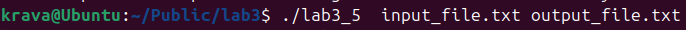
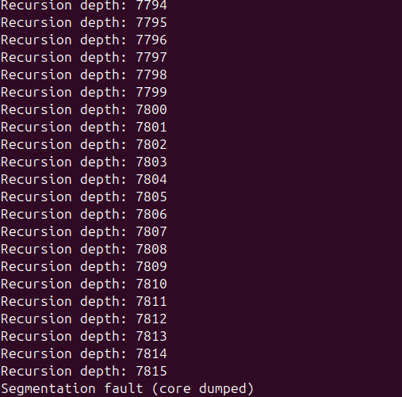
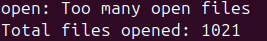

## ПРАКТИЧНА 3

## Завдання 1

Запустіть Docker-контейнер і поекспериментуйте з максимальним лімітом ресурсів відкритих файлів. Для цього виконайте команди у вказаному порядку:
$ ulimit -n
$ ulimit -aS | grep "open files"
$ ulimit -aH | grep "open files"
$ ulimit -n 3000
$ ulimit -aS | grep "open files"
$ ulimit -aH | grep "open files"
$ ulimit -n 3001
$ ulimit -n 2000
$ ulimit -n
$ ulimit -aS | grep "open files"
$ ulimit -aH | grep "open files"
$ ulimit -n 3000

Як наступне вправу, повторіть перераховані команди з root-правами.

## Результат 

## Результат з root правами

## Опис
Ulimit дозволяє керувати обмеженнями системних ресурсів ,soft limit  можна змінювати в межах hard limit.
Навіть root-користувач у контейнері не може підняти hard limit, якщо його не вказано при запуску.

## Завдання 2 

У Docker-контейнері встановіть утиліту perf(1). Поекспериментуйте з досягненням процесом встановленого ліміту.

## Результат  
Утиліта perf дає змогу задавати жорсткі обмеження на ресурси, визначити повведінку програми , визначати ліміт відкритих файлів та досягнення ліміту продуктивності .

## Завдання 3

Напишіть програму, що імітує кидання шестигранного кубика. Імітуйте кидки, результати записуйте у файл, для якого попередньо встановлено обмеження на його максимальний розмір (max file size). Коректно обробіть ситуацію перевищення ліміту.

 ## Код програми 
[Код](lab3_3/lab3_3.c)

## Опис програми
Програма симулює гру кидання в кубика ,  програма зчитує та записує результат кидків  в файл , поки файл розмір не стане більше ніж 100 байтів . Після цього програма завершує роботу та виводить повідомлення про це .

## Результат 

## Завдання 4

Напишіть програму, що імітує лотерею, вибираючи 7 різних цілих чисел у діапазоні від 1 до 49 і ще 6 з 36. Встановіть обмеження на час ЦП (max CPU time) і генеруйте результати вибору чисел (7 із 49, 6 із 36). Обробіть ситуацію, коли ліміт ресурсу вичерпано.

 ## Код програми 
[Код](lab3_4/lab3_4.c)

## Опис програми
Програма реалізує гру в лотерею , вибірками чисел  7 з 49 та 6 з 36. Використовується ліміт на час , після якого програма буде завершена та виведенно повідомлення про перевищення ліміту . Ліміт встановлюється через системний виклик setrlimit. Випадкові числа генеруються через алгоритм перемішування масвів. 
## Результат 

## Завдання 5

Напишіть програму для копіювання одного іменованого файлу в інший. Імена файлів передаються у вигляді аргументів.
Програма має:
перевіряти, чи передано два аргументи, інакше виводити "Program need two arguments";
перевіряти доступність першого файлу для читання, інакше виводити "Cannot open file .... for reading";
перевіряти доступність другого файлу для запису, інакше виводити "Cannot open file .... for writing";
обробляти ситуацію перевищення обмеження на розмір файлу.

 ## Код програми 
[Код](lab3_5/lab3_5.c)

## Опис програми

Програма копіює вміст з одного файлу у інший . Перед цим перевіряються умови , а саме чи передаються два файли для роботи програми у інакшому випадку повідомляється про помилку як наведенно нижче.  Перевірка чи вхідний файл доступний для зчитння , якщо файл не вікривається для зчитання програма завершує роботу. Перевірка на розмір файлу , якщо розмір файлу більший за допустимий то програма завершить роботу.  У разі якщо програма запущенна павильно , програма копіює вміст файлу , використовуючи для цього буфер розміром 4000 байт .

## Результат 

## Завдання 6
Напишіть програму, що демонструє використання обмеження (max stack segment size). Підказка: рекурсивна програма активно використовує стек.

## Код програми 
[Код](lab3_6/lab3_6.c)

## Опис програми
Програма виконує рекурсивний виклик функції , збільшуючи розмір кожного виклику, що заповнює стек .Функція recurse у кожному виклику функції створює масив розмір якого 1024 байт. Функція виводить глибину рекурсії .Програма призводить до переповнення стеку.

## Результат 

## Завдання по варіантах

## Варіант 8 

## Завдання
Написати програму, що генерує велику кількість дескрипторів файлів.

## Код програми 
[Код](lab3_7/lab3_7.c)

## Опис програми

## Результат 

