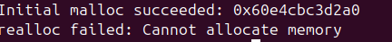
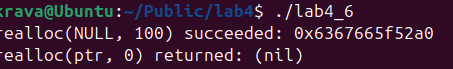
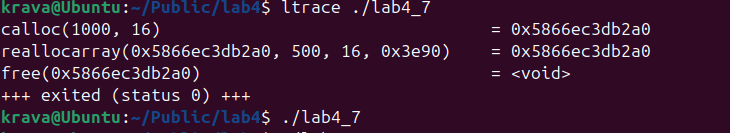
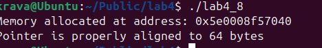

## ПРАКТИЧНА 4 

## Завдання 1 

Скільки пам’яті може виділити malloc(3) за один виклик?
Параметр malloc(3) є цілим числом типу даних size_t, тому логічно максимальне число, яке можна передати як параметр malloc(3), — це максимальне значення size_t на платформі (sizeof(size_t)). У 64-бітній Linux size_t становить 8 байтів, тобто 8 * 8 = 64 біти. Відповідно, максимальний обсяг пам’яті, який може бути виділений за один виклик malloc(3), дорівнює 2^64. Спробуйте запустити код на x86_64 та x86. Чому теоретично максимальний обсяг складає 8 ексабайт, а не 16?

 ## Код програми 
[Код](lab4_1/lab4_1.c)

## Опис програми
Програма намагється виділити великий обсяг памяті розміро 2^63 байти за допомогою функції malloc. Такий великий обсяг памяті неможливо виділити в цих умовах. Функція поверне значення NULL  що практично означає помилку так як неможливо виділити цей обсяг. Програма виведе помилку .Причина чому не 16 ексабайт, а 8 полягає у системних обмеженнях .

## Результат 

## Завдання 2
Що станеться, якщо передати malloc(3) від’ємний аргумент? Напишіть тестовий випадок, який обчислює кількість виділених байтів за формулою num = xa * xb. Що буде, якщо num оголошене як цілочисельна змінна зі знаком, а результат множення призведе до переповнення? Як себе поведе malloc(3)? Запустіть програму на x86_64 і x86.

 ## Код програми 
[Код](lab4_2/lab4_2.c)

## Опис програми
Програма демонструє переповнення змінної int про розрахунку розміру памяті. Що призводитиь до небезпечного виклику malloc. Добуток змінних перевищує 32 бітного int і через це відбувається переповнення , через це  значення num стає відємним . У x86 переповнення гарантовано, що malloc() поверне NULL.  У x86_64  значення буде перетворене у величезне size_t, що може спричинити malloc failure

## Результат 

## Завдання 3
Що станеться, якщо використати malloc(0)? Напишіть тестовий випадок, у якому malloc(3) повертає NULL або вказівник, що не є NULL, і який можна передати у free(). Відкомпілюйте та запустіть через ltrace. Поясніть поведінку програми.

 ## Код програми 
[Код](lab4_3/lab4_3.c)

## Опис програми
Програма тестує поведінку функції malloc(0), яка хоче виділити нульовий обсяг памяті. програма перевіряє результат та виводиться повернення NULL. Запуск програми через ltrace показує що malloc(0) викликається

## Результат 

## Завдання 4
Чи є помилки у такому коді?
void *ptr = NULL;
while (<some-condition-is-true>) {
    if (!ptr)
        ptr = malloc(n);
    [... <використання 'ptr'> ...]
    free(ptr);
}

Напишіть тестовий випадок, який продемонструє проблему та правильний варіант коду.

 ## Код програми 
[Код](lab4_4/lab4_4.c)

## Опис програми
Програма виділяє обсяг памяті по 100 байт тричі через malloc та перевіряє виділення на успішність. Вивиодиться адреси виділених областей памяті , а потім звільянє їх.Програма демонструє безпечне звільнення памяті , так як після кожного хвільнення вказівник обнуляється.Проблема у демонстративному варіанті полягає в тому що після першої ітерації вказівник ptr більше не нуль але адреса звільненана і нова память не буде виділена.

## Результат 

## Завдання 5
Що станеться, якщо realloc(3) не зможе виділити пам’ять? Напишіть тестовий випадок, що демонструє цей сценарій.

 ## Код програми 
[Код](lab4_5/lab4_5.c)

## Опис програми
Програма виділяє 1024 байти памяті за допомогою malloc, потім програма намагється роширити память більше зберігаючи результат у новому вказівнику . Коли програма не може виділити память повертається NULL.

## Результат 

## Завдання 6
Якщо realloc(3) викликати з NULL або розміром 0, що станеться? Напишіть тестовий випадок.

 ## Код програми 
[Код](lab4_6/lab4_6.c)

## Опис програми
Програма викликає realloc(NULL, 100) на о функція повертає вказівник , потім память звільняється , realloc(NULL, size) працює як malloc(size) створюючи новий блок памяті ,realloc(ptr, 0) звільняє памʼять і повертає NULL.

## Результат 

## Завдання 7
Перепишіть наступний код, використовуючи reallocarray(3):
struct sbar *ptr, *newptr;
ptr = calloc(1000, sizeof(struct sbar));
newptr = realloc(ptr, 500*sizeof(struct sbar));

Порівняйте результати виконання з використанням ltrace.

 ## Код програми 
[Код](lab4_7/lab4_7.c)

## Опис програми
ППрограма виділяє пам’ять для 1000 структур  з нульовою ініціалізацією, а потім зменшує розмір блоку до 500 елементів за допомогою reallocarray для уникнення переповнення при обчисленні розміру, після чого звільняє пам’ять.
## Результат 

## Завдання по варіантах

## Варіант 8

## Завдання
Використайте aligned_alloc для виділення пам’яті з певним вирівнюванням.
## Код програми 
[Код](lab4_8/lab4_8.c)

## Опис програми
Програма використовує функцію aligned_alloc для виділення блоку памяті, перевіряє, чи вказівник на виділену пам'ять відповідає зазначеному вирівнюванню, перевіряючи залишок від ділення адреси на 64. Якщо адреса правильно вирівняна, то виводиться повідомлення про правильне вирівнювання, інакше виникає про помилку. Після цього пам'ять звільняється 

## Результат 

