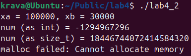
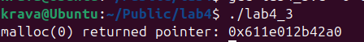
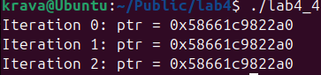

## ПРАКТИЧНА 4 

## Завдання 1 

Скільки пам’яті може виділити malloc(3) за один виклик?
Параметр malloc(3) є цілим числом типу даних size_t, тому логічно максимальне число, яке можна передати як параметр malloc(3), — це максимальне значення size_t на платформі (sizeof(size_t)). У 64-бітній Linux size_t становить 8 байтів, тобто 8 * 8 = 64 біти. Відповідно, максимальний обсяг пам’яті, який може бути виділений за один виклик malloc(3), дорівнює 2^64. Спробуйте запустити код на x86_64 та x86. Чому теоретично максимальний обсяг складає 8 ексабайт, а не 16?

 ## Код програми 
[Код](lab4_1/lab4_1.c)

## Опис програми
Програма намагється виділити великий обсяг памяті розміро 2^63 байти за допомогою функції malloc. Такий великий обсяг памяті неможливо виділити в цих умовах. Функція поверне значення NULL  що практично означає помилку так як неможливо виділити цей обсяг. Програма виведе помилку .Причина чому не 16 ексабайт, а 8 полягає у системних обмеженнях .

## Результат 

## Завдання 2
Що станеться, якщо передати malloc(3) від’ємний аргумент? Напишіть тестовий випадок, який обчислює кількість виділених байтів за формулою num = xa * xb. Що буде, якщо num оголошене як цілочисельна змінна зі знаком, а результат множення призведе до переповнення? Як себе поведе malloc(3)? Запустіть програму на x86_64 і x86.

 ## Код програми 
[Код](lab4_2/lab4_2.c)

## Опис програми
Програма демонструє переповнення змінної int про розрахунку розміру памяті. Що призводитиь до небезпечного виклику malloc. Добуток змінних перевищує 32 бітного int і через це відбувається переповнення , через це  значення num стає відємним . У x86 переповнення гарантовано, що malloc() поверне NULL.  У x86_64  значення буде перетворене у величезне size_t, що може спричинити malloc failure

## Результат 

## Завдання 3
Що станеться, якщо використати malloc(0)? Напишіть тестовий випадок, у якому malloc(3) повертає NULL або вказівник, що не є NULL, і який можна передати у free(). Відкомпілюйте та запустіть через ltrace. Поясніть поведінку програми.

 ## Код програми 
[Код](lab4_3/lab4_3.c)

## Опис програми
Програма тестує поведінку функції malloc(0), яка хоче виділити нульовий обсяг памяті. програма перевіряє результат та виводиться повернення NULL. Запуск програми через ltrace показує що malloc(0) викликається

## Результат 

## Завдання 4
Чи є помилки у такому коді?
void *ptr = NULL;
while (<some-condition-is-true>) {
    if (!ptr)
        ptr = malloc(n);
    [... <використання 'ptr'> ...]
    free(ptr);
}

Напишіть тестовий випадок, який продемонструє проблему та правильний варіант коду.

 ## Код програми 
[Код](lab4_4/lab4_4.c)

## Опис програми
Програма тестує поведінку функції malloc(0), яка хоче виділити нульовий обсяг памяті. програма перевіряє результат та виводиться повернення NULL. Запуск програми через ltrace показує що malloc(0) викликається

## Результат 

