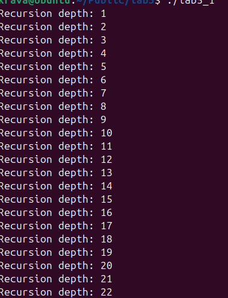
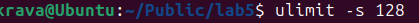

## ПРАКТИЧНА 5 

## Завдання
 Напишіть програму, яка звертається до стеку поза межами дозволеної області, але система не видає Segmentation Fault.

[Код програми ](lab5.c)

## Опис програми 
Програма використовує рекурсію, за для того щоб стек памяті був заповнений , функція рекурсії виділяє буфер , програма записує значення в буфер . У звичайному випадку ця програма виклече Segmentation Fault, але стек у системі дуже великий і  Segmentation Fault не виникає .

## Результат виконання 

