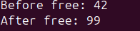

## ПРАКТИЧНА 6

## ЗАВДАННЯ 

Test Case #8: Use-after-free. Виділіть памʼять, звільніть, спробуйте записати в неї.

## КОД ПРОГРАМИ
[lab6](lab6.c)

## Опис завдання 

Программа виділяє память для цілого числа і туди записує значення 42, після цього програма звільняє це місце і звертається до звільненого місця і записує значення 99. Такі дії є незвичними і можу призвести до помилки .

##  Результат виконання 
 

