## ПРАКТИЧНА 7

## Завдання 1 

Використайте popen(), щоб передати вивід команди rwho (команда UNIX) до more (команда UNIX) у програмі на C

 ## Код програми 
[Код](lab7_1/lab7_1.c)

## Опис програми

Програма показує використання popen, для запуску зовнішніх команд.Програма запускає команду rwho для виводу списку користувачів у системі і спрямовує вихід до команди more.Це зроблено через popen , потім дані передаються з одного потоку в інший .Програма завершує роботу через pclose

## Результат 
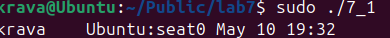

## Завдання 2
 Напишіть програму мовою C, яка імітує команду ls -l в UNIX — виводить список усіх файлів у поточному каталозі та перелічує права доступу тощо.
 (Варіант вирішення, що просто виконує ls -l із вашої програми, — не підходить.)

 ## Код програми 
[Код](lab7_2/lab7_2.c)

## Опис програми
Програма виводить список файлів у директорії за допомогою команди ls -l та перелічує права доступу . Програма відкриває каталог за допомогою opendir, далі функція readdir поверає записи про файли , перебираючи кожен файли крім тих які починаються з .Функція stat зчитує дан про файли та повертає дані про тип файлу, права доступу , розмір . getpwuid повертає структуру ,getgrgid повертає структуру групи . Програма виводиь розмір файлу, імя та жорсткі посиилання .
## Результат 
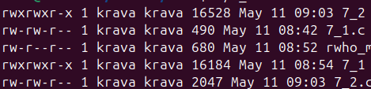

## Завдання 3
 Напишіть програму, яка друкує рядки з файлу, що містять слово, передане як аргумент програми (проста версія утиліти grep в UNIX).

 ## Код програми 
[Код](lab7_3/lab7_3.c)

## Опис програми
Програма реалізує пошук у тексті за допомогою стандартних функцій .
## Результат 
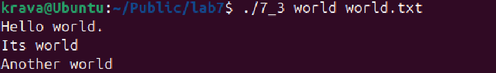

## Завдання 4
Напишіть програму, яка виводить список файлів, заданих у вигляді аргументів, з зупинкою кожні 20 рядків, доки не буде натиснута клавіша (спрощена версія утиліти more в UNIX).

 ## Код програми 
[Код](lab7_4/lab7_4.c)

## Опис програми
Програма виводить список айлів у виляді аргументів з зупинкою у кожних 20 рядків де для продовження роботи потрібно натиснути ентер ,та завершує роботу коли дані у файлі закінчуються .
## Результат 
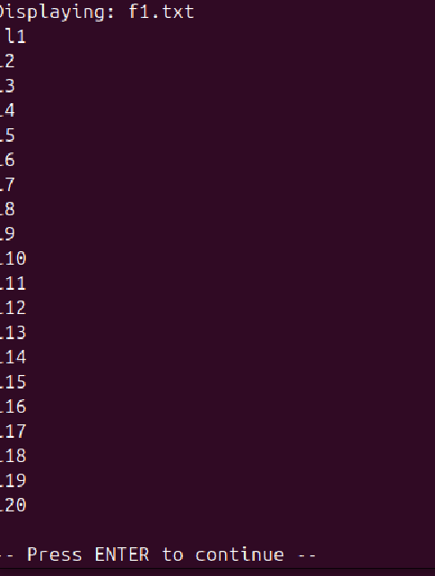

## Завдання 5
Напишіть програму, яка перелічує всі файли в поточному каталозі та всі файли в підкаталогах.

 ## Код програми 
[Код](lab7_5/lab7_5.c)

## Опис програми
Програма перелічує всі файли в поточній директорії. 
## Результат 
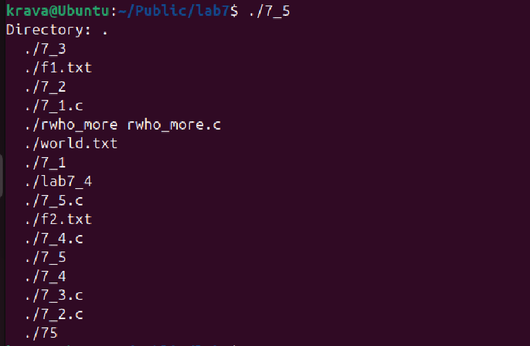

## Завдання 6
Напишіть програму, яка перелічує лише підкаталоги у алфавітному порядку.

 ## Код програми 
[Код](lab7_6/lab7_6.c)

## Опис програми
Програма зчитує каталоги через opendir і readdir, потім фільтрує підкаталоги через d_type == DT_DIR ігноруючи службові підкаталоги . Сортується імена за допомогою  qsort та strcmp у динамічному масиві . Виводиться результат у алфавітному порядку## Результат 
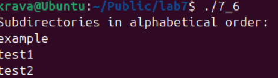

## Завдання 7
 Напишіть програму, яка показує користувачу всі його/її вихідні програми на C, а потім в інтерактивному режимі запитує, чи потрібно надати іншим дозвіл на читання (read permission); у разі ствердної відповіді — такий дозвіл повинен бути наданий.

 ## Код програми 
[Код](lab7_7/lab7_7.c)

## Опис програми
Програма знаходить усі файли з роширенням с у директорії , перевіряє їх тип . Запитує права на зчитування , якщо дохвіл наданний то це виконується .

## Результат 
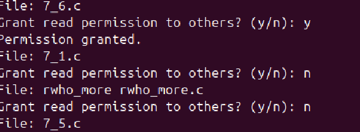

## Завдання 8
Напишіть програму, яка надає користувачу можливість видалити будь-який або всі файли у поточному робочому каталозі. Має з’являтися ім’я файлу з запитом, чи слід його видалити.

## Код програми 
[Код](lab7_8/lab7_8.c)

## Опис програми
Програма відкриває директорію  , переглядається вміст директорії , пропускаютться файли з початком спеціальних елементів . Для кожного файлу програма запитує чи бажаєте її видалити , і якщо користувач повідомляє що так Ю файл видаляється .

## Результат 
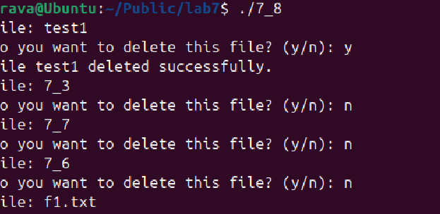

## Завдання 9
 Напишіть програму на C, яка вимірює час виконання фрагмента коду в мілісекундах.

## Код програми 
[Код](lab7_9/lab7_9.c)

## Опис програми
Програма вимірює виконання фрагменту коду в мілісекундах отримуючи дві часові мітки , через clock_gettim , облчислюється різниц між ними в секундах та наносекундах і перетворення на мілісекунди .

## Результат 
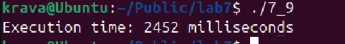

## Завдання 10
 Напишіть програму мовою C для створення послідовності випадкових чисел з плаваючою комою у діапазонах:
 (a) від 0.0 до 1.0
 (b) від 0.0 до n, де n — будь-яке дійсне число з плаваючою точкою.
 Початкове значення генератора випадкових чисел має бути встановлене так, щоб гарантувати унікальну послідовність.

## Код програми 
[Код](lab7_10/lab7_10.c)

## Опис програми
Програма реалізує генерацію випадкових чисел у заданному діапазоні. Ініціалізаця генератора чисел дозволяє отримувати нову унікальну послідовність чисел при кожному запуску .

## Результат 
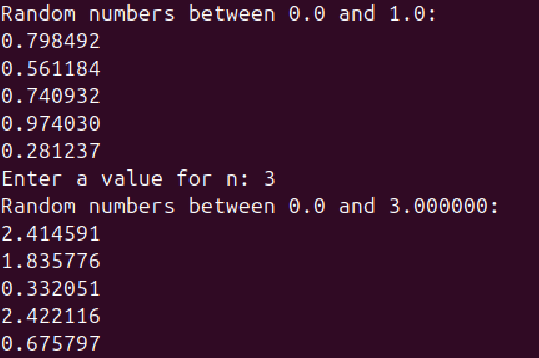

## Завдання по варіантах

## Варіант 8

## Завдання
Реалізуйте функціонал cron, який не використовує жодного фону або демонів.

## Код програми 
[Код](lab7_11/lab7_11.c)

## Опис програми
Реалізовано функціонал cron  без використання демонів .На прикладі програми яка запускає дію у заданний час . 

## Результат 
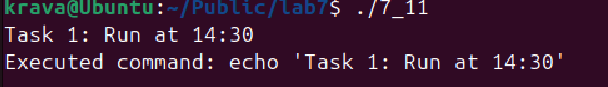
