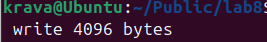
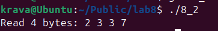
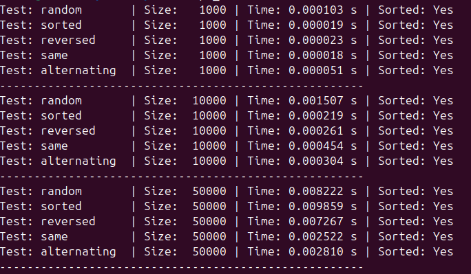
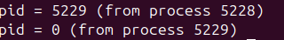
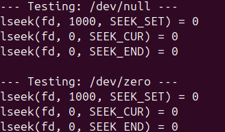

## ПРАКТИЧНА 8

## Завдання 1

Чи може виклик count = write(fd, buffer, nbytes); повернути в змінній count значення, відмінне від nbytes? Якщо так, то чому? Наведіть робочий приклад програми, яка демонструє вашу відповідь.

## Опис
Так, цей виклик має повернути значення яке відрізняється з nbytes, це означає , що використанно менша кількість байтів ніж запитувала програма . Програма показує як це працює , створює пайп , дескриптор вказується неблокуючий тобто якщо програма має дані то виведе їх , якщо ж данниї немає иведе помилку , далі програма записує буфер , і наслідком якщо пайп не прийме всі байти чрез обмеження , повернеться менше байтів ніж nbytes/

## Код програми 
[Код](lab8_1/lab8_1.c)

## Результат 

## Завдання 2 

 Є файл, дескриптор якого — fd. Файл містить таку послідовність байтів: 4, 5, 2, 2, 3, 3, 7, 9, 1, 5. У програмі виконується наступна послідовність системних викликів:
lseek(fd, 3, SEEK_SET);
read(fd, &buffer, 4);
де виклик lseek переміщує покажчик на третій байт файлу. Що буде містити буфер після завершення виклику read? Наведіть робочий приклад програми, яка демонструє вашу відповідь.
## Код програми 
[Код](lab8_2/lab8_2.c)

## Опис
Програма після виклику lseek перемістив показник на 3 позицію, зчитавши 4 байти саме ті які починаються з 3 байта . Буфер містить  чотири байти зі значеннями 2, 3, 3, 7

## Результат  

## Завдання 3

 Бібліотечна функція qsort призначена для сортування даних будь-якого типу. Для її роботи необхідно підготувати функцію порівняння, яка викликається з qsort кожного разу, коли потрібно порівняти два значення.
 Оскільки значення можуть мати будь-який тип, у функцію порівняння передаються два вказівники типу void* на елементи, що порівнюються.
Напишіть програму, яка досліджує, які вхідні дані є найгіршими для алгоритму швидкого сортування. Спробуйте знайти кілька масивів даних, які змушують qsort працювати якнайповільніше. Автоматизуйте процес експериментування так, щоб підбір і аналіз вхідних даних виконувалися самостійно.

Придумайте і реалізуйте набір тестів для перевірки правильності функції qsort.

 ## Код програми 
[Код](lab8_3/lab8_3.c)

## Опис програми
Пргорама тестує правильність виконнання сортування qsosrt ,  генерує різні типи вхідних маисвів, вимірює час виконання qsort задля порівнняня , що займає найбільше часу .В результаті пргормаи , виявлено що найбільше займає часу для сортування вже відсортованні масиви але великих розмірів , та довільні масиви .
## Результат 

## Завдання 4

 Виконайте наступну програму на мові програмування С:
int main() {
  int pid;
  pid = fork();
  printf("%d\n", pid);
}
Завершіть цю програму. Припускаючи, що виклик fork() був успішним, яким може бути результат виконання цієї програми?

 ## Код програми 
[Код](lab8_4/lab8_4.c)

## Опис програми
Програма виконуєтться так , fork створює дочірній процес, після виклику обидва процеси продовжують виконання з одного й того ж рядка, але в результаті повертаються два рядки один від дочірнього інший від батьківського , значення pid буде різний .  
## Результат 

## Завдання 5

Напишіть тестовий фреймворк, який досліджує, як працює lseek() з файлами /dev/null та /dev/zero.

 ## Код програми 
[Код](lab8_5/lab8_5.c)

## Опис програми

Програма відкриває файл dev/null  або /dev/zero у режимі для читання, виконує 3 функції , і повертає результат кожного з них .Всі результати повертають 0 бо ці файли не мають реальної довжини 

## Результат 

