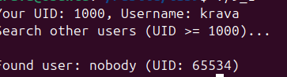
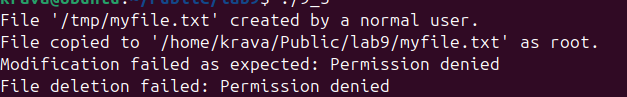
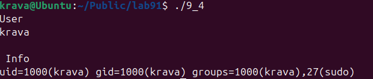
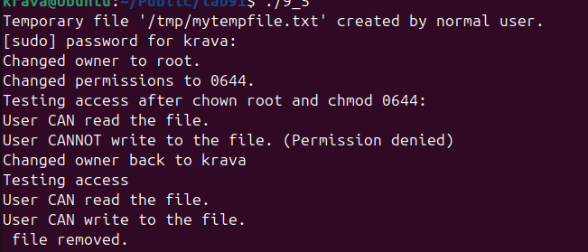
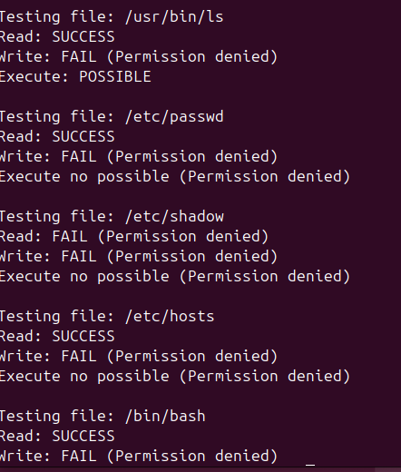
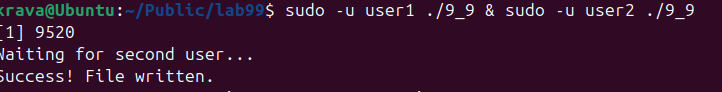
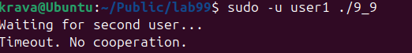

## ПРАКТИЧНА 9

## Завдання 1

Напишіть програму, яка читає файл /etc/passwd за допомогою команди getent passwd, щоб дізнатись, які облікові записи визначені на вашому комп’ютері.
 Програма повинна визначити, чи є серед них звичайні користувачі (ідентифікатори UID повинні бути більші за 500 або 1000, залежно від вашого дистрибутива), окрім вас.
 ## Код програми 
[Код](lab9_1.c)

## Опис
Програма викликає getent passwd для інформації про обліковий запис , визначає звиайних користувачів , виводиьь це списком , та виводить повідомлення чи знайдено їх .
## Результат 

## Завдання 2 

Напишіть програму, яка виконує команду cat /etc/shadow від імені адміністратора, хоча запускається від звичайного користувача.
 (Ваша програма повинна робити необхідне, виходячи з того, що конфігурація системи дозволяє отримувати адміністративний доступ за допомогою відповідної команди.)

## Опис програми
 Програма показує виконання команди з підвищеними правами доступу від імені адміна із середовища звичайого користувача. Зчитується файл який недоступнмй без рут прав але використовужмо команду sudo. Відбувається зчитування і виконується команда sudo і програма виконується .
 ## Код програми 
[Код](lab9_2/9_2.c)

## Результат  

## Завдання 3

 Напишіть програму, яка від імені root копіює файл, який вона перед цим створила від імені звичайного користувача. Потім вона повинна помістити копію у домашній каталог звичайного користувача.
 Далі, використовуючи звичайний обліковий запис, програма намагається змінити файл і зберегти зміни. Що відбудеться?
 Після цього програма намагається видалити цей файл за допомогою команди rm. Що відбудеться?

 ## Код програми 
[Код](lab9_3/lab9_3.c)

## Опис програми
Програма запускається від імені адміна створює текствовий файл , далі файл копіюється у домашній каталог . Відкривається файл для змін і програма завершує роботу , видаляючи файл але цього не стається бо  root володіє файлом.

## Результат 

## Завдання 4

Напишіть програму, яка по черзі виконує команди whoami та id, щоб перевірити стан облікового запису користувача, від імені якого вона запущена.
 Є ймовірність, що команда id виведе список різних груп, до яких ви належите. Програма повинна це продемонструвати.

 ## Код програми 
[Код](lab9_4/lab9_4.c)

## Опис програми
Програма послідовно виконує дві системні команди  whoami і id —щоб отримати інформацію про поточний обліковий запис користувача, під яким вона запущена. Команда whoami виводить ім'я користувача, що виконує програму.Команда id виводить детальну інформацію про ідентифікатори користувача. Ввиводиться індифікатор користувача та індифікатор групи . 

## Результат 

## Завдання 5

 Напишіть програму, яка створює тимчасовий файл від імені звичайного користувача. Потім від імені суперкористувача використовує команди chown і chmod, щоб змінити тип володіння та права доступу.
 Програма повинна визначити, в яких випадках вона може виконувати читання та запис файлу, використовуючи свій обліковий запис.

 ## Код програми 
[Код](lab9_5/lab9_5.c)

## Опис програми

Програма  створює тимчасовий файл від  імені звичайного користувача, виконує команду sudo команди chown та chmod щоб змінити права доступу. Після цього програма перевіряє чи може звичайний користувач зчитат і редагувати файл . Користувач в цій ситуації мож читати файл . Після повернення прав назад користувач зможе і читати і редагувати . Після ьього файл видаляється 

## Результат 

## Завдання 6
 Напишіть програму, яка виконує команду ls -l, щоб переглянути власника і права доступу до файлів у своєму домашньому каталозі, в /usr/bin та в /etc.
 Продемонструйте, як ваша програма намагається обійти різні власники та права доступу користувачів, а також здійснює спроби читання, запису та виконання цих файлів.

## Код програми 
[Код](lab9_6/lab9_6.c)

## Опис програми
Програма автоматично перевіряє права доступу до файлів у системі . Використовує системні виклики для відкритття файлів і перевірки прав виконання .

## Результат 

## Завдання по варіантах

## Варіант 8 

## Завдання
Створіть групу користувачів, яка має повний доступ до окремої директорії, але жоден з учасників не має доступу до неї окремо.

## Код програми 
[Код](lab9_7/lab9_7.c)

## Опис програми

Програма , щоб група користувачів у моєму випадку два користувача мали доступ разом , але не омгли б мати доступ кожен окремо реаліовано так , спочатку за допомогою команди sudo chmod 000 /tmp/groupdir закриваю повністю доступ о неї .Далі реалізована програма яка надає доступ групі користувачів разом доступ до файлу у директорії . На результаті ми бчимо що якщо запускати програму для одного користувача то програма не відкриється і робота завершиться . Якщо за допомогою & обєднати команду для двох відразу користувачів то файл буде відкритим . 

## Результат 

